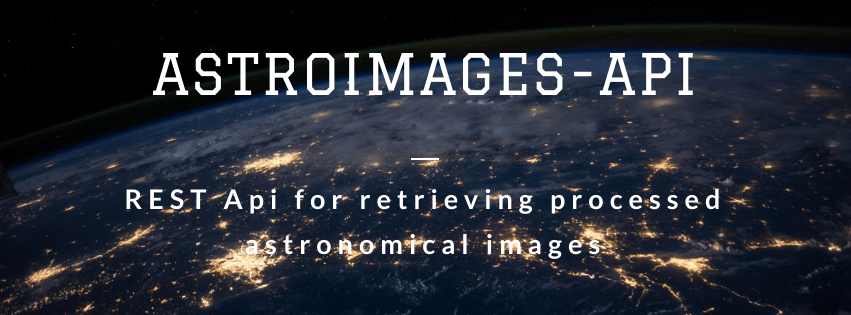

AstroImages API (astroimages-api)
=================================


[](#)

[](https://sonarcloud.io/dashboard?id=AstroImages_astroimages-api)
[](https://lgtm.com/projects/g/AstroImages/astroimages-api/context:python)
[](https://scrutinizer-ci.com/g/AstroImages/astroimages-api/?branch=master)
[](https://travis-ci.com/AstroImages/astroimages-api)


REST API for listing processed images


Usage
-----

Clone the repo:

```console
$ git clone https://github.com/AstroImages/astroimages-api/
$ cd astroimages-api
```


Create and activate virtualenv:

```console
$ virtualenv -p python3 env
$ source env.sh
(env) $ pip3 install -r requirements.txt
```

Run the server via CLI

```console
(env) $ ./start-server.sh
```
    
Or build the docker image

```console
(env) $ docker build -t astroimages-api:latest .
```
Then run the docker image silently

```console
(env) $ docker run -d -p 5000:5000 astroimages-api
```
Or verbose

```console
(env) $ docker run --rm -ti -p 5000:5000 astroimages-api
```

And finally try the endpoints:

```console
(env) $ ./tests/start-tests-fits.sh
```

## Testing

To run unit tests:

```console
(env) $ python -m unittest discover test/unit -v
```

## Author

**Rodrigo de Souza**

* Website: http://www.rodrigosouza.net.br
* Github: [@rsouza01](https://github.com/rsouza01)
* LinkedIn: [@rsouza01](https://linkedin.com/in/rsouza01)

## Tools

- Banner made with BannerSnack

## Show your support

Give a ⭐️ if this project helped you!


## [References](REFERENCES.md)


License
-------

Astroimages-api is released under the [MIT License](LICENSE).

